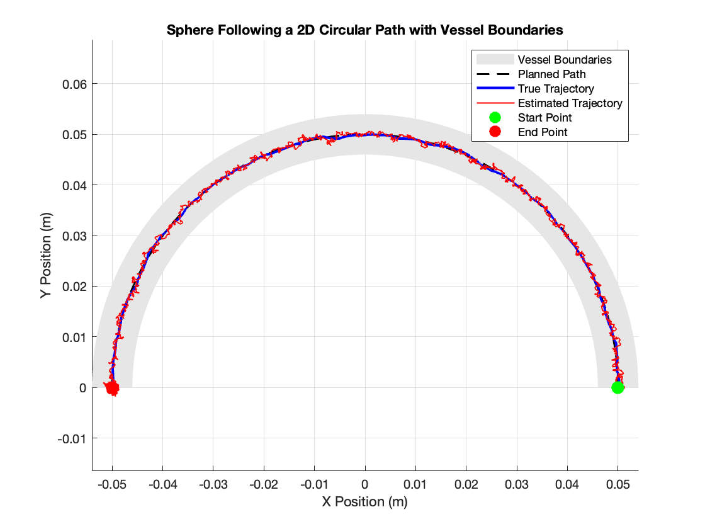

# MRI-Guided Robotic Navigation: Simulation of Tetherless Milli-Robots in Vascular Pathways
**Carter Ung**



## Summary
This project explores the motion of a tetherless ferromagnetic sphere along 2D vascular paths. We aim to enhance trajectory tracking accuracy by incorporating optimal control forces into a PID controller and Kalman Filter, refining the balance between propulsion and correctional forces. Additionally, we simulate the sphere's motion along predefined vascular paths, such as circular and custom trajectories, while adhering to safety constraints within the guidance corridor. By focusing on these enhancements, our work provides a foundation for future research into extending these methods to more complex 3D environments and real-world clinical applications. 

## Run Simulation
To run our MATLAB script, open `main.m` and press `Run` and you will be prompted the following:

```plaintext
Choose the path type:
1: Circular Path
2: Straight Horizontal Path
3: Angled Straight Path
4: Custom Curved Path with Turns
Enter 1, 2, 3, or 4 for the corresponding path:
```

Please select the desired path for the Sphere to follow. Then you will be asked if you want the visualization to be animated:

```plaintext
Do you want to animate the path (Yes or No):
```
Please type in either `Yes` or `No`. You will then be given four graphs:

```plaintext
1. Gradient 
2. Velocity Error
3. Position Error
4. Control Path in Vessel Visualization
```

## References

We build our work upon the following **[Reference Paper](https://swarmcontrol.ece.uh.edu/wp-content/papercite-data/pdf/8206550.pdf)**:
```
@INPROCEEDINGS{8206550,
  author={Kensicher, Thibault and Leclerc, Julien and Biediger, Daniel and Shah, Dipan J. and Seimenis, Ioannis and Becker, Aaron T. and Tsekos, Nikolaos V.},
  booktitle={2017 IEEE/RSJ International Conference on Intelligent Robots and Systems (IROS)}, 
  title={Towards MRI-guided and actuated tetherless milli-robots: Preoperative planning and modeling of control}, 
  year={2017},
  volume={},
  number={},
  pages={6440-6447},
  keywords={Propulsion;Safety;Robots;Arteries;Tumors},
  doi={10.1109/IROS.2017.8206550}}
```
